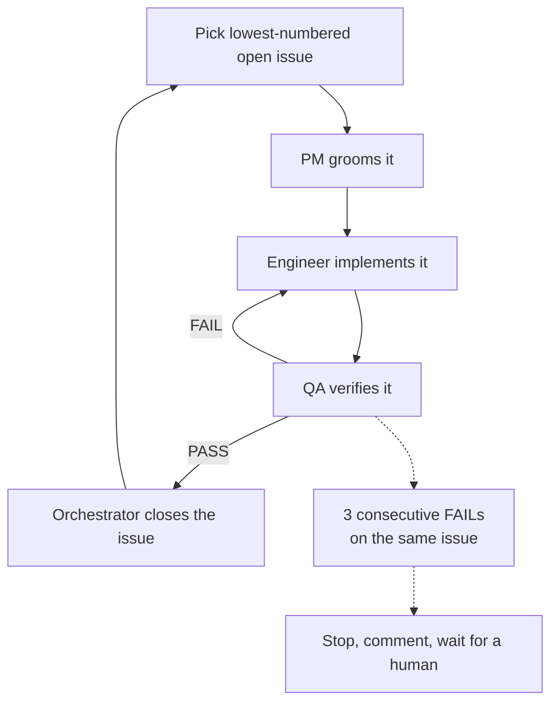

# Household Chores Manager

A web app that gives a family of 4 a shared, clear system for household chores — fixed weekly assignments, daily checklists, time budgets, and swap tracking.

Built as Homework 1 for [AI Dev Tools Zoomcamp](https://github.com/DataTalksClub/ai-dev-tools-zoomcamp) (DataTalksClub).

## Scope

See [`_docs/outdated/plan.md`](_docs/outdated/plan.md) for the original spec (users, features, out-of-scope for v1). Superseded day-to-day by the GitHub issue backlog — see Engineering process below.

## Stack

- Python + Django
- [uv](https://docs.astral.sh/uv/) for dependency management and running commands

## Setup

```bash
uv sync
uv run python manage.py migrate
uv run python manage.py createsuperuser  # the shared family login
uv run python manage.py seed_family      # creates 4 placeholder Person rows
uv run python manage.py runserver
```

## Usage

### `/admin/` guide

Chores, assignments, and people have no in-app create/edit UI yet — use Django admin (log in with the superuser from setup):

| Section | Model | What it's for |
|---|---|---|
| People | Person | Rename the 4 seeded placeholders, set role, set daily/weekly budget minutes |
| Chores | Chore | Define a chore (name, description, default duration) |
| Chores | Weekly assignment template | Fix a chore to a person + day-of-week + time — this is the recurring weekly plan |
| Chores | Chore instance, Swap log | Read-only, system-generated — for debugging/history, don't edit by hand |

Everything else (check-off, time-log, swap, propose/approve changes) has its own page, reached from the dashboard.

### Day to day

1. Log in at `/login/`, pick your profile at `/profile/`
2. Dashboard (`/`) — today's chores; that week's instances generate automatically on page load, no separate step
3. Calendar (`/calendar/?week=YYYY-MM-DD`) — any week, past weeks are read-only

## Engineering process

Every task is a GitHub issue, built by three roles orchestrated in sequence — PM grooms, Engineer implements, QA verifies. See [`_docs/process.md`](_docs/process.md) and the role definitions under [`_docs/team/`](_docs/team/) for the full detail.



- The engineer never closes the issue; QA never fixes code, only outputs PASS or FAIL
- A FAIL retry goes straight back to the engineer — PM re-grooms only a fresh issue, not a retry
- After 3 consecutive FAILs on the same issue, the loop stops and waits for a human instead of retrying forever

## Tests

```bash
uv run python manage.py test
```
